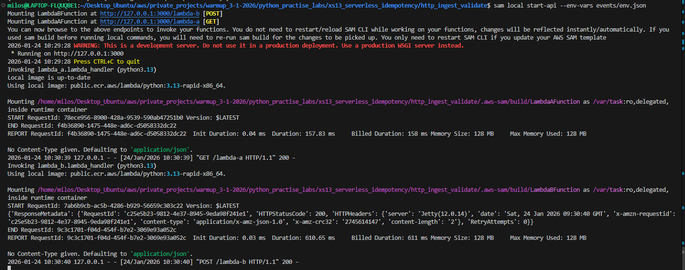
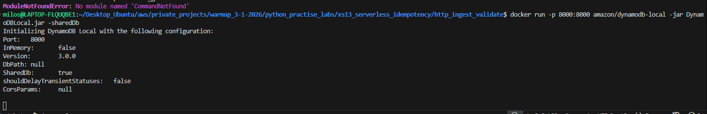
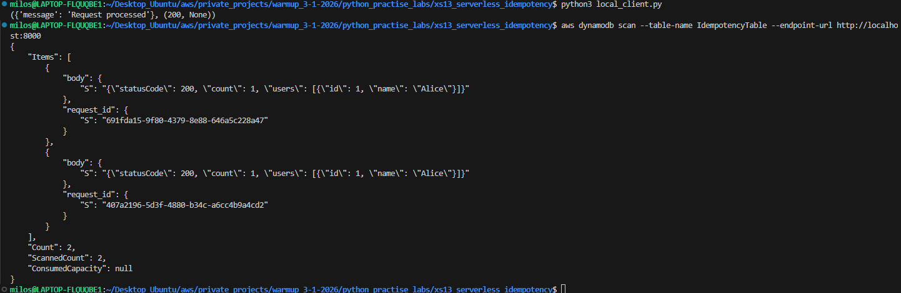
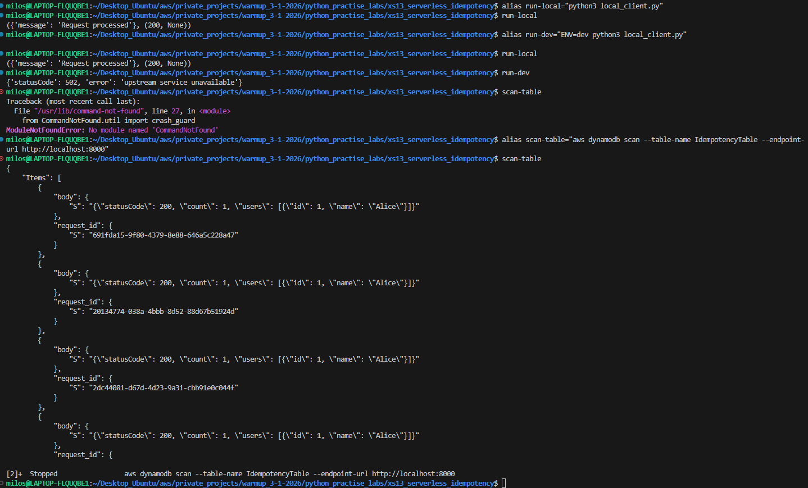
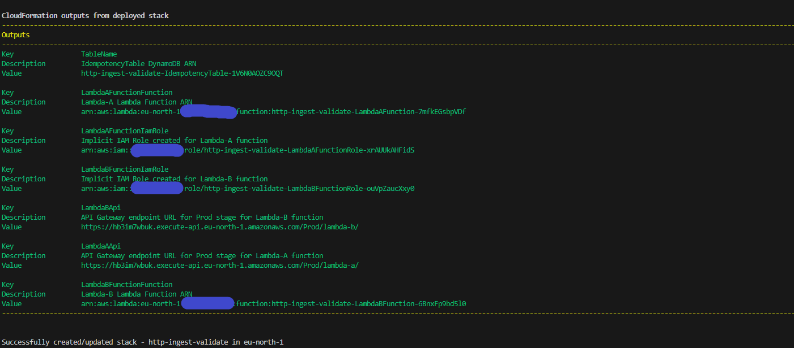
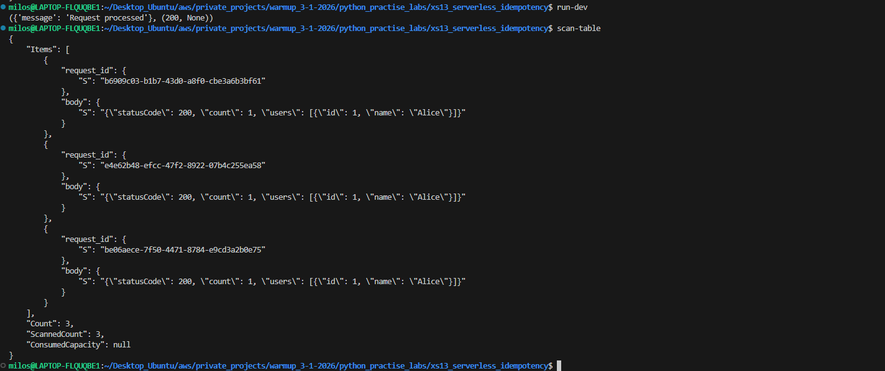

# XS13 - Serverless HTTP Ingest with Idempotency

## TL;DR

XS13 demonstrates a serverless HTTP ingest pipeline using AWS Lambda and DynamoDB,
focusing on idempotent writes, retry logic, and backend data validation patterns.

Core concepts:
- HTTP ingest
- exponential backoff
- idempotency via DynamoDB
- AWS SAM local development

A Python practice project demonstrating HTTP request handling, data validation/normalization, exponential backoff retry logic, and idempotent writes using AWS Lambda, API Gateway, and DynamoDB.

## Project Goals

**Primary Learning Objectives:**
- Practice HTTP requests (GET + POST) with `requests` library
- Implement data validation and normalization from external APIs
- Apply exponential backoff retry patterns
- Implement idempotency using DynamoDB conditional writes
- Use AWS SAM for rapid serverless infrastructure deployment
- Test locally with SAM CLI and DynamoDB Local

**Non-Goals:**
- SQS integration or message queuing
- Production scaling considerations
- Production hardening and security

## Architecture
[local_client.py]
↓ GET /lambda-a
[Lambda A] → Returns mock user data
↓
[local_client.py] → Validates & normalizes data
↓ POST /lambda-b + Idempotency-Key
[Lambda B] → DynamoDB conditional write
↓
[DynamoDB] → Prevents duplicate processing

## Screenshots

The following screenshots demonstrate local development, deployment,
and successful execution of the XS13 serverless pipeline.

### API Gateway — SAM local


### DynamoDB — local instance


### Local client execution


### API Gateway aliases


### SAM deployment success


### Online stack execution



## Components

### 1. Lambda A (`lambda_a.py`)
- **Purpose**: Mock external API endpoint
- **Method**: GET `/lambda-a`
- **Returns**: JSON with user data (id, name, active status)

### 2. Lambda B (`lambda_b.py`)
- **Purpose**: Idempotent data storage
- **Method**: POST `/lambda-b`
- **Features**:
  - Accepts `Idempotency-Key` header
  - Uses DynamoDB conditional writes (`attribute_not_exists`)
  - Returns 200 for both new and duplicate requests

### 3. Local Client (`local_client.py`)
- **Purpose**: Orchestrates the complete workflow
- **Features**:
  - Fetches data from Lambda A with exponential backoff
  - Validates and normalizes JSON response
  - Filters for active users only
  - Writes to Lambda B with idempotency guarantees

### 4. Infrastructure (`template.yaml`)
- **AWS SAM template** defining:
  - Two Lambda functions with API Gateway triggers
  - DynamoDB table for idempotency tracking
  - IAM roles and permissions

## Key Implementation Details

### Data Validation Pipeline
```python
# Input validation chain
fetch_users() → clean_and_validate_response() → get_active_users() → build_output()
```
### Exponential Backoff
- 3 retry attempts with 2^attempt second delays
- Applied to both GET and POST operations
- Handles network timeouts and HTTP errors

### Idempotency Pattern
```python
# DynamoDB conditional write
table.put_item(
    Item={"request_id": idempotency_key, "body": json.dumps(body)},
    ConditionExpression="attribute_not_exists(request_id)"
)
```
### Data Normalization
- Converts string IDs to integers
- Normalizes boolean values from strings ("true"/"false")
- Strips whitespace and validates required fields
- Filters out invalid/incomplete records

### Local Development Setup
**Prerequisites**
- Python 3.13+
- AWS SAM CLI
- Docker
- AWS CLI

**Environment Configuration**
Create environment files:

.env.local:
```bash
URL_GET=http://localhost:3000/lambda-a
URL_POST=http://localhost:3000/lambda-b
TIMEOUT=5
```

.env.dev:
```bash
URL_GET=https://your-api-gateway-url/Prod/lambda-a
URL_POST=https://your-api-gateway-url/Prod/lambda-b
TIMEOUT=10
```

### Local Development Workflow
1. **Start Local DynamoDB**:
```bash
docker run -p 8000:8000 amazon/dynamodb-local -jar DynamoDBLocal.jar -sharedDb
```

2. **Create Local Table**:
```bash
aws dynamodb create-table \
    --table-name IdempotencyTable \
    --attribute-definitions AttributeName=request_id,AttributeType=S \
    --key-schema AttributeName=request_id,KeyType=HASH \
    --billing-mode PAY_PER_REQUEST \
    --endpoint-url http://localhost:8000
```

3. **Start Local API**:
```bash
sam build
sam local start-api --env-vars events/env.json
```

4. **Run Client**:
```bash
# Local environment
python local_client.py

# Dev environment  
ENV=dev python local_client.py
```

**Useful Commands**
**Database Operations**:
```bash
# Scan local table
aws dynamodb scan --table-name IdempotencyTable --endpoint-url http://localhost:8000

# Scan deployed table
aws dynamodb scan --table-name your-deployed-table-name
```

**Deployment**:
```bash
# Deploy to AWS
sam deploy --guided

# Delete stack
sam delete --stack-name http-ingest-validate
```

**Testing Individual Functions**:
```bash
# Test Lambda A
sam local invoke LambdaAFunction

# Test Lambda B
sam local invoke LambdaBFunction --event events/event.json --env-vars events/env.json
```
